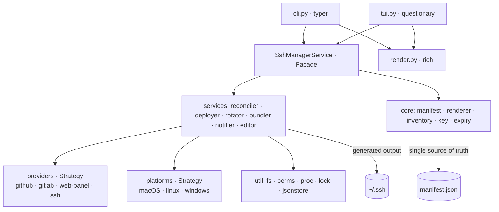
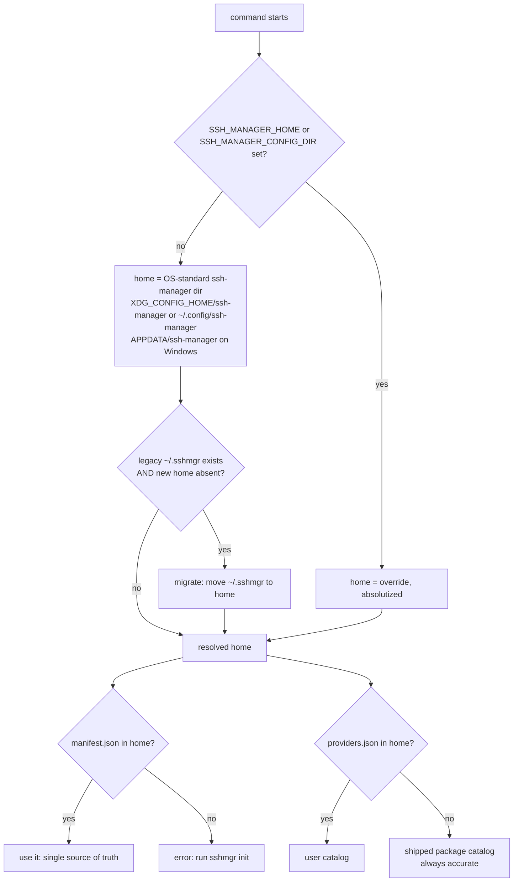
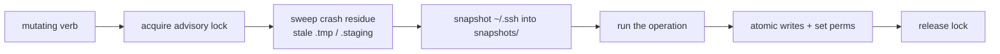
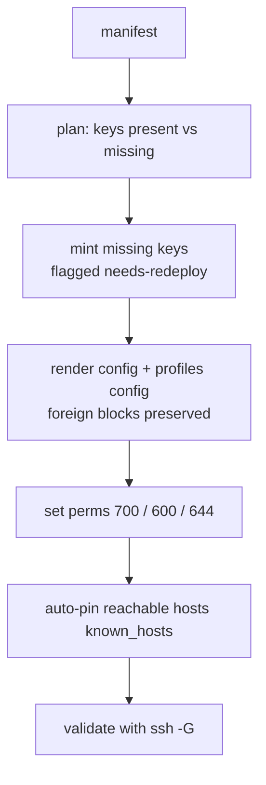
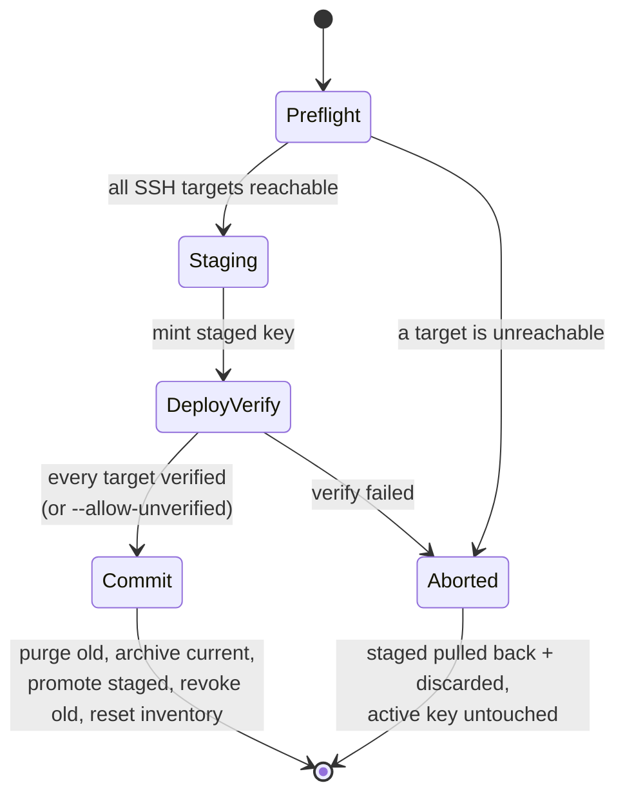

# Architecture



```
src/ssh_manager/
  cli.py            # typer; thin - parse args, call the Facade (no logic)
  tui.py            # interactive surface (rich+questionary, Prompter seam) - over the Facade
  render.py         # rich presentation (tables/trees/panels/icons) over service data
  core/             # pure domain: manifest, key, inventory, renderer, expiry
  services/         # use-cases: facade, reconciler, configsvc, importer, deployer, rotator,
                    #   notifier, bundler, editor, knownhosts, query, keystore, agent, preflight
  providers/        # Strategy: github, gitlab, cloud(DO/Vultr/Hetzner/Linode/
                    #   Scaleway/GenericRest), ssh_generic, registry, base
  platforms/        # Strategy: macos + linux (first-class), windows + detect()
  data/             # fixkeys.sh (break-glass recovery, shipped in the wheel)
  util/             # fs, perms, proc, http, log, lock, jsonstore, paths, errors
  templates/        # jinja2: root_config.j2, profile_config.j2
config/             # source-of-truth defaults: example manifest/inventory + the
                    #   providers catalog (packaged; the shipped default) + schema/.
                    #   live home = OS-standard ssh-manager dir, see util/paths + platforms
```

## Key flows

### Home + config resolution (manifest first; user, else shipped default)



### Mutation guard (wraps every state-changing verb)



### reconcile: manifest to ~/.ssh



### rotate: zero-downtime, single-old-archive



## Everything lives under the profile (and securely)

`~/.ssh` is **generated output**, organized so that everything belonging to one
identity sits under that identity's profile dir - and nothing crosses profiles:

```
~/.ssh/
├── config                         # marked ssh-manager block (Include + global Host*);
│                                   # foreign content (e.g. OrbStack) outside it is kept
└── profiles/
    ├── work/
    │   ├── config                 # 600 - this profile's Host blocks
    │   ├── known_hosts            # 644 - this profile's OWN host-key trust store
    │   ├── work_unc-ed25519       # 600 - private key, never leaves the machine
    │   ├── work_unc-ed25519.pub   # 644 - public key
    │   ├── old/                   # ≤1 archived predecessor per key (rotation)
    │   └── .staging/              # transient, only mid-rotation
    ├── personal/  ...  (github.com via its own key + known_hosts)
    └── simtabi/   ...  (github.com again, but a SEPARATE key + known_hosts)
```

Per-profile isolation is enforced by the rendered config:

- `IdentityFile ~/.ssh/profiles/<p>/<key>` + `IdentitiesOnly yes` → a host is only
  ever offered **its own** key (no cross-offer, no lockouts).
- `UserKnownHostsFile ~/.ssh/profiles/<p>/known_hosts` → host-key trust is scoped
  to the identity; trusting `github.com` as `personal` never trusts it as `simtabi`.
- Perms are load-bearing and uniform (dirs 700, private keys + config 600, public
  keys + known_hosts 644), set on create and re-asserted by `doctor`/`reconcile`.

The manifest is the single source of truth; `reconcile` regenerates this whole
tree from it (and `restore` brings the same keys back from an age bundle).

## Patterns

- **Facade** (`services/facade.py`) - the one API the CLI/TUI/desktop call.
- **Strategy** - `providers/` (deployment adapters) and `platforms/` (OS behaviour).
- **Repository** - `Manifest` / `Inventory` load/save through the atomic JSON store.
- **Command** - one CLI verb per use-case. **Factory** - key/provider creation.

## Load-bearing rules

- **One renderer.** `config render`, `config check`, and `reconcile` all call
  `core/renderer.render_all`. `check` renders to a buffer and compares
  byte-for-byte, so the verifier and the writer can never disagree.
- **Atomic + locked state.** All state/config writes go through
  `util/jsonstore` + `util/fs` (temp + `os.replace`) under `util/lock`.
- **Perms via the platform layer.** `platform.set_perms` is the single chokepoint
  for `chmod`/ACLs; `util/perms.mode_for` owns the path→mode policy.
- **Subprocess chokepoint.** Every shell-out goes through `util/proc` (argv lists,
  never `shell=True`).
- **One mutation at a time.** The advisory lock is held for the whole mutating
  verb, including provider network calls in `deploy`/`rotate`/delete (so a
  single-user run is serialized and can't interleave). Every `ssh`/CLI/HTTP call is
  hard-timeout-bounded, so a slow provider blocks other invocations only for that
  bounded window, never indefinitely.

## Platform layer

`platforms.detect()` returns the OS strategy. `emits_use_keychain` decides whether
the renderer emits the macOS-only `UseKeychain` line; `first_class` drives the
preflight "support in progress" note. **macOS, Linux, and Windows are all
first-class.** Each is validated on its own CI runner: Linux (systemd-user timer /
cron scheduler, `notify-send`), and Windows (`icacls` owner-only ACLs, `schtasks`,
PowerShell toast) - the latter via real-binary tests plus a full
reconcile/perms/config end-to-end on the windows-latest runner.
