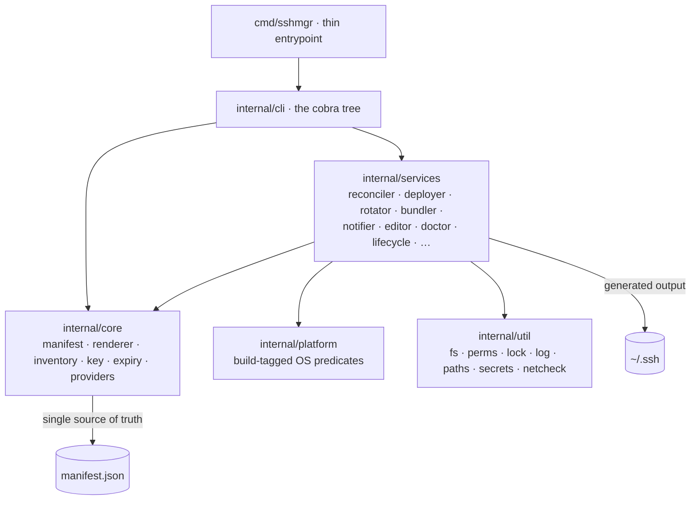
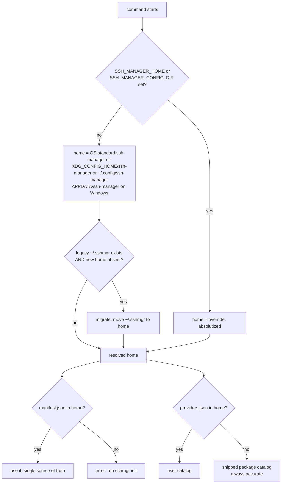
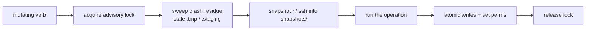
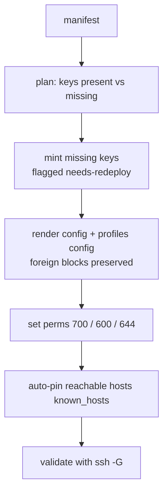
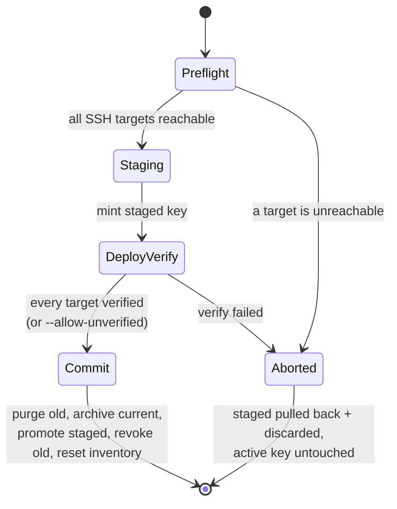

# Architecture


```mermaid
flowchart TD
    MAIN[cmd/sshmgr · thin entrypoint] --> CLI[internal/cli · the cobra tree]
    CLI --> SVC[internal/services<br/>reconciler · deployer · rotator · bundler ·<br/>notifier · editor · doctor · lifecycle · …]
    CLI --> CORE[internal/core<br/>manifest · renderer · inventory · key · expiry · providers]
    SVC --> CORE
    SVC --> PLAT[internal/platform<br/>build-tagged OS predicates]
    SVC --> UTIL[internal/util<br/>fs · perms · lock · log · paths · secrets · netcheck]
    CORE -->|single source of truth| MAN[(manifest.json)]
    SVC -->|generated output| SSH[(~/.ssh)]
```

There is no facade. `internal/cli` is where composition happens, and it is a
leaf: nothing under `internal/` imports it. `internal/core` is the domain and
depends on nothing above it. Both directions are asserted by
`src/cmd/sshmgr/layering_test.go`, along with a ceiling on methods-per-type - the
v1 facade type carried 54 and every verb hung off it.

The repository has two roots. Everything the Go toolchain reads lives under
`src/`, which is the module; everything the repository presents - README,
LICENSE, CHANGELOG, `docs/`, `.github/` - stays at the top. Build output is a
property of the repository rather than of the module, so there is one `build/`
at the root and not one per module.

```
src/                # THE GO MODULE. go.mod is here, so every `go` command runs
                    #   here - the Makefile uses `go -C src` for exactly this.
  cmd/sshmgr/       # thin entrypoint; calls internal/cli and nothing else
  internal/
    cli/            # the cobra tree, one file per verb. The ONLY package that
                    #   imports cobra, and the only place services are composed.
                    #   exit.go owns the exit-code contract; mutate.go the guard.
    core/           # pure domain: manifest, renderer, inventory, key, expiry,
                    #   authkeys, providers (adapters + the embedded catalog)
    services/       # use-cases, one concern each: reconciler, configsvc, importer,
                    #   deployer, rotator, notifier, bundler, editor, knownhosts,
                    #   query, keystore, agent, preflight, doctor, snapshots,
                    #   validate, recover, initsvc, migratesvc, netstat, keyaudit,
                    #   keysvc, lifecycle
    platform/       # build-tagged OS predicates and terminal handling
                    #   (*_darwin.go, *_linux.go, *_windows.go, *_other.go)
    util/           # fs, perms, lock, log, paths, secrets, netcheck, scheduler,
                    #   homeperms, askpass, httpjson, desktop
  config/           # the shipped example manifest/inventory, the providers
                    #   catalog, and the JSON schemas. providers.json here is
                    #   byte-identical to the copy embedded in the binary.
  scripts/          # install.sh, install.ps1, build-all.sh, extract-changelog.sh
                    #   - the four artifacts that must stay shell
  .goreleaser.yaml  # release config; runs from the repo root (see below)
  .golangci.yml
build/              # everything build-related, and the only place anything is
                    #   generated. targets.txt (the release matrix) is the one
                    #   tracked file; build/sshmgr is `make build` output and
                    #   build/dist/ is GoReleaser's. `make clean` empties it.
docs/  README.md  CHANGELOG.md  LICENSE  Makefile  .github/
```

Package paths below are written relative to the module, so `internal/cli` is
`src/internal/cli` on disk; the Go import path is
`github.com/simtabi/ssh-manager/src/v3/internal/cli`.

Two paths deliberately cross that boundary, and both are commented where they
occur. GoReleaser runs from the repo root with `builds[].dir: src`, because its
archive globbing will not climb out of its own working directory to reach
LICENSE and README. And `build-all.sh` runs from the module - `go build` needs
that - while writing into the repo-root `build/`.

One third-party dependency: `github.com/spf13/cobra`. That is asserted, not
aspirational - there is nowhere for a presentation or HTTP library to hide.

## Key flows

### Home + config resolution (manifest first; user, else shipped default)


```mermaid
flowchart TD
    S[command starts] --> O{SSH_MANAGER_HOME or<br/>SSH_MANAGER_CONFIG_DIR set?}
    O -- yes --> OV[home = override, absolutized]
    O -- no --> STD[home = OS-standard ssh-manager dir<br/>XDG_CONFIG_HOME/ssh-manager or ~/.config/ssh-manager<br/>APPDATA/ssh-manager on Windows]
    STD --> MIG{legacy ~/.sshmgr exists<br/>AND new home absent?}
    MIG -- yes --> MOVE[migrate: move ~/.sshmgr to home]
    MIG -- no --> R[resolved home]
    MOVE --> R
    OV --> R
    R --> MANI{manifest.json in home?}
    MANI -- yes --> SRC[use it: single source of truth]
    MANI -- no --> EI[error: run sshmgr init]
    R --> CAT{providers.json in home?}
    CAT -- yes --> UC[user catalog]
    CAT -- no --> SP[shipped package catalog<br/>always accurate]
```

### Mutation guard (wraps every state-changing verb)


```mermaid
flowchart LR
    V[mutating verb] --> LK[acquire advisory lock]
    LK --> SW[sweep crash residue<br/>stale .tmp / .staging]
    SW --> SN[snapshot ~/.ssh into snapshots/]
    SN --> OP[run the operation]
    OP --> AW[atomic writes + set perms]
    AW --> UL[release lock]
```

### reconcile: manifest to ~/.ssh


```mermaid
flowchart TD
    MAN[manifest] --> PLAN[plan: keys present vs missing]
    PLAN --> MINT[mint missing keys<br/>flagged needs-redeploy]
    MINT --> REN[render config + profiles config<br/>foreign blocks preserved]
    REN --> PER[set perms 700 / 600 / 644]
    PER --> PIN[auto-pin reachable hosts known_hosts]
    PIN --> GV[validate with ssh -G]
```

### rotate: zero-downtime, single-old-archive


```mermaid
stateDiagram-v2
    [*] --> Preflight
    Preflight --> Staging: all SSH targets reachable
    Preflight --> Aborted: a target is unreachable
    Staging --> DeployVerify: mint staged key
    DeployVerify --> Commit: every target verified<br/>(or --allow-unverified)
    DeployVerify --> Aborted: verify failed
    Commit --> [*]: purge old, archive current,<br/>promote staged, revoke old, reset inventory
    Aborted --> [*]: staged pulled back + discarded,<br/>active key untouched
```

## One config, one trust store, keys under the profile

`~/.ssh` is **generated output**. Everything belonging to one identity sits under
that identity's profile directory, and nothing crosses profiles:

```
~/.ssh/
├── config                          # 600 - ONE file. A marked ssh-manager block
│                                   #   holds every Host entry, grouped by profile
│                                   #   banner with `Host *` last. Foreign content
│                                   #   outside the markers is preserved verbatim.
├── known_hosts                     # 600 - ONE hashed trust store. Lines this tool
│                                   #   pinned carry an `sshmgr` comment tag, so it
│                                   #   only ever prunes its own.
└── profiles/
    ├── work/                       # keys only - no config, no known_hosts
    │   ├── work_hpc-ed25519        # 600 - private key, never leaves the machine
    │   ├── work_hpc-ed25519.pub    # 644 - public key
    │   ├── old/                    # <=1 archived predecessor per key (rotation)
    │   └── .staging/               # transient, only mid-rotation
    ├── personal/  ...  (github.com via its own key)
    └── simtabi/   ...  (github.com again, but a SEPARATE key)
```

Per-profile isolation is enforced by the rendered config, not by the file layout:

- `IdentityFile ~/.ssh/profiles/<p>/<key>` plus **per-host** `IdentitiesOnly yes`
  means a host is only ever offered **its own** key. No cross-offer, and no
  lockout from an agent volunteering five keys before the right one.
- Perms are load-bearing (dirs 700, private keys and the config 600, public keys
  644), set on create and re-asserted by `doctor` and `reconcile` - which walk the
  same enumeration, so they cannot disagree about what is managed.

> `known_hosts` is 600, not the conventional 644. ssh has never needed the trust
> store world-readable, and its contents are an inventory of every host you
> connect to - which is also why the names in it are hashed.

The manifest is the single source of truth; `reconcile` regenerates this whole
tree from it (and `restore` brings the same keys back from an age bundle).

## Patterns

- **Strategy** — `internal/core/providers` (deployment adapters) and
  `internal/platform` (OS behaviour, selected by build tag rather than at runtime).
- **Repository** — `Manifest` and `Inventory` load and save atomically.
- **Command** — one CLI verb per use-case, composed in `internal/cli`.

There is deliberately no facade. See *Why is there no single service object?* below.

## Load-bearing rules

- **One renderer.** `config render`, `config check` and `reconcile` all call
  `internal/core/renderer`. `check` renders to a buffer and compares byte for
  byte, so the verifier and the writer can never disagree.
- **Atomic + locked state.** Every state and config write goes through
  `internal/util/fs` (temp file, then rename over) under `internal/util/lock`.
  Both `manifest.Save` and `inventory.Save` claimed this while using
  `os.WriteFile`, which truncates first and keeps whatever mode the file had;
  both are now genuinely atomic and both re-assert 0600.
- **Perms through one chokepoint.** `internal/util/perms.SetPerms` is the single
  place modes and ACLs are applied; `perms.ModeFor` owns the path-to-mode policy
  and `perms.IterManagedPaths` is the one enumeration both the fixer and the
  checker walk.
- **Subprocess policy.** Every external command is an argv slice, never a shell
  string. The tool's entire external-binary surface is pinned by a test, so a new
  shell-out has to be declared.
- **One mutation at a time.** The advisory lock is held for the whole mutating
  verb, including provider network calls in `deploy`, `rotate` and the deletes, so
  a single-user run is serialised and cannot interleave. Every `ssh`, CLI and HTTP
  call is hard-timeout-bounded, so a slow provider blocks other invocations only
  for that bounded window, never indefinitely. The lock is taken once per process,
  not once per call: `flock` is per descriptor, so a second acquire in the same
  process waits forever on a lock that process is already holding.

## Why the v2 layout is what it is

### Why one inline config and one `known_hosts`?

v1 wrote a `config` and a `known_hosts` per profile and stitched them together
with `Include`. That put the trust store's isolation in the file layout, which
made it fragile in two ways: `Include` ordering is subtle enough that a
hand-edited file could silently stop applying, and a per-profile store meant the
same host key was verified and stored several times over.

The isolation that actually matters — a host is only ever offered its own key —
comes from `IdentityFile` plus a **per-host** `IdentitiesOnly yes`, which the
single inline config states explicitly for every host. So the guarantee is
stronger and the layout is simpler. The one trust store is hashed, and every line
this tool writes carries an `sshmgr` comment tag so pruning only ever removes its
own.

This is the one place the Go implementation deliberately does not match v1's
output. Everything else does.

### Why is there no single service object?

v1 had a `SshManagerService` facade: 1356 lines, 54
methods, every verb hanging off it. It was the natural place for logic to
accumulate, and it did. `internal/cli` composes services directly instead, and a
test enforces the shape — a ceiling on methods per type, plus the two dependency
directions (nothing under `internal/` imports `internal/cli`; `core` never
imports `services`).

Services composing one another is fine and expected: `reconciler` needs
`keystore`, `doctor` needs `preflight`. That is layering, not a God object.

### Why is the TUI a plain menu?

v1 used `rich` and `questionary`. The Go binary has one third-party dependency,
`cobra`, and no presentation library — so output is plain text that a pipe can
read and the TUI is a numbered stdin menu rather than a full-screen application.
That is a real loss of polish and a real gain in portability: nothing to render,
nothing to detect, and every command's output is machine-readable by default.

### Why does a `key_name` repeat across profiles?

v1 rejected a manifest where two profiles declared the same key name. One person
working under two organisations uses the same file name in both, so that ban
prevented a normal setup. A key's identity here is the pair `profile/key`, not
the bare name — which is also why `keygen --force` confirms per key rather than
per name.

### Why does the passphrase go through askpass?

`ssh-keygen -N <passphrase>` puts the secret in the command line, where any local
user can read it out of the process list. It is handed over through the askpass
protocol instead, and offered on stdin for pre-8.4 versions that read it there.

### Why does `GenericSSH` fall back to plain `ssh`?

Microsoft's OpenSSH port does not ship `ssh-copy-id`. `ssh-copy-id` is a shell
script around one command, so the fallback does the same thing — same modes, same
dedupe, same result — and on Windows it is the normal path rather than a fallback.

### Why does `agent load` skip a key no host uses?

An agent holds keys for connections. A key a profile declares that no host
references serves no connection, and loading it would offer an extra identity to
every server you subsequently talk to. This differs from `reconcile`, `validate`
and the dangling-key audit, which all deliberately do consider unwired keys —
those are asking "does this key exist and is it healthy", which is a different
question.

## Platform layer

`internal/platform` answers OS questions through build-tagged files rather than a
runtime switch, so each platform's code only exists where it can run.
`EmitUseKeychain` decides whether the renderer emits the macOS-only `UseKeychain`
line. **macOS, Linux, and Windows are all
first-class.** Each is validated on its own CI runner: Linux (systemd-user timer /
cron scheduler, `notify-send`), and Windows (`icacls` owner-only ACLs, `schtasks`,
PowerShell toast). The Windows leg matters: it is the only place the tagged code
runs at all, and the first time it did it found four defects nothing else could
see - a test home that was never isolated there, an advisory lock that leaked its
descriptor, and two mode assertions with no ACL guard.

---

[← Docs index](../README.md#documentation)
